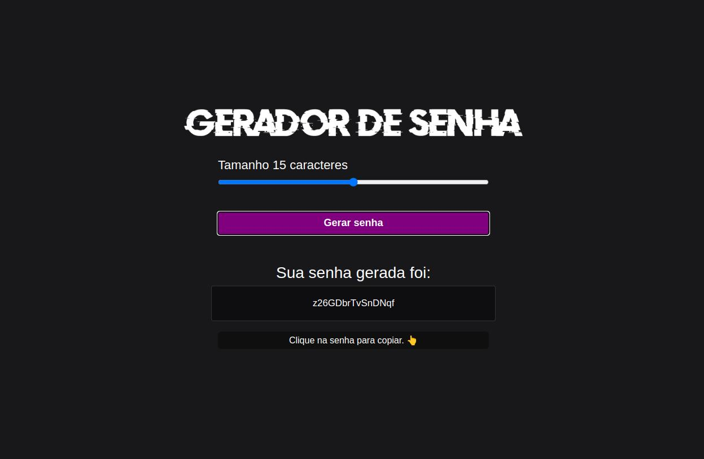

<h1 align="center"> Generator </h1>

Programa exclusivo e gratuito, desenvolvido como fonte de estudos.

  <a href="#-tecnologias">Tecnologias</a>&nbsp;&nbsp;&nbsp;|&nbsp;&nbsp;&nbsp;
  <a href="#-projeto">Projeto</a>&nbsp;&nbsp;&nbsp;&nbsp;&nbsp;&nbsp;

 

  

## 🚀 Tecnologias

Esse projeto foi desenvolvido com as seguintes tecnologias:

- HTML e CSS
- JavaScript
- Git e Github

## 💻 Projeto

O Generator é, inicialmente um gerador de senhas online, com a possibilidade de definir a quantidade de caracteres desejados. A ideia é futuramente implementar mais funções e aprimorar os recursos já existentes.

---

Feito com ♥ by Bruno Oliveira :wave: [Descubra o conteúdo por trás da inspiração!](https://discord.gg/rocketseat)
